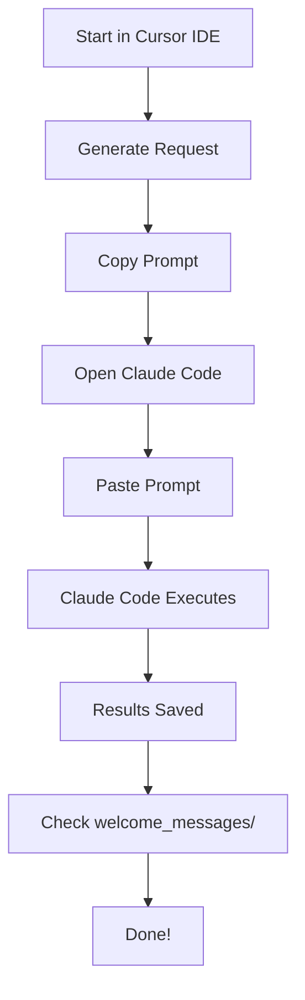

# Quick Reference: Dual-Mode Intro Extraction

## 🚀 Quick Start

### In Cursor IDE
```bash
# Generate request for Claude Code
python3 intro_extraction_api.py 2025-10-01 2025-10-09

# Copy the output prompt
# Paste into Claude Code
```

### In Claude Code
```
Ask Claude: "Extract Slack intros from Oct 1-9 using claude_code_executor.py"
```

---

## 📋 Common Commands

### Cursor IDE

```bash
# Auto-detect dates from last report
python3 intro_extraction_api.py

# Specific date range
python3 intro_extraction_api.py 2025-10-01 2025-10-09

# Save request to file
python3 -c "from intro_extraction_api import generate_mcp_request; \
generate_mcp_request('2025-10-01', '2025-10-09', 'my_request.json')"

# Run tests
python3 test_dual_mode.py
```

### Claude Code

```
# Natural language
"Extract Slack intros from October 1-9, 2025"

# Using executor
"Run claude_code_executor.py for dates 2025-10-01 to 2025-10-09"

# Using API directly
"Import intro_extraction_api and run extract_intros_mcp_mode 
with start_date='2025-10-01' and end_date='2025-10-09'"
```

---

## 🔍 Quick Checks

### Verify Environment
```python
from intro_extraction_api import detect_execution_environment
print(detect_execution_environment())  # 'mcp' or 'cursor'
```

### Test Both Modes
```bash
python3 test_dual_mode.py
```

### Check MCP Connection (Claude Code only)
```
Ask Claude: "Test Zapier MCP connection by searching Slack for 'test'"
```

---

## 📁 File Locations

| File | Purpose | Used In |
|------|---------|---------|
| `intro_extraction_api.py` | Main dual-mode API | Both |
| `claude_code_executor.py` | Claude Code executor | Claude Code |
| `test_dual_mode.py` | Test suite | Both |
| `daily_intros.py` | Original script (still works) | Both |
| `DUAL_MODE_USAGE.md` | Full documentation | Reference |
| `BRANCH_README.md` | Branch overview | Reference |

---

## 🎯 Output Files

| File | Location | Description |
|------|----------|-------------|
| Markdown Report | `welcome_messages/daily_intros_YYYY-MM-DD.md` | Human-readable report |
| JSON Results | `intro_results_[timestamp].json` | Machine-readable data |
| Request File | Custom path or `request_[timestamp].json` | For later execution |

---

## ⚠️ Common Issues

| Issue | Environment | Solution |
|-------|-------------|----------|
| "MCP tools not available" | Cursor IDE | ✅ Expected - use `generate_mcp_request()` |
| "MCP tools not available" | Claude Code | ❌ Check MCP server connection |
| "Zapier quota exceeded" | Both | Upgrade Zapier plan or wait for reset |
| "No intros found" | Both | Check date range and #intros channel |

---

## 🔄 Typical Workflow



**Time**: ~2-3 minutes total

---

## 📊 Feature Comparison

| Feature | Cursor IDE | Claude Code |
|---------|------------|-------------|
| Generate Requests | ✅ | ✅ |
| Execute Extraction | ❌ | ✅ |
| Save Results | ❌ | ✅ |
| Review Before Run | ✅ | ⚠️ Partial |
| Batch Requests | ✅ | ✅ |
| Auto-Detection | ✅ | ✅ |
| MCP Tools Access | ❌ | ✅ |

---

## 🔗 Links

- [Full Documentation](DUAL_MODE_USAGE.md)
- [Branch Details](BRANCH_README.md)
- [MCP Setup](README_MCP_SETUP.md)
- [Security Guide](SECURITY.md)

---

## 💡 Pro Tips

### Cursor IDE
- Save requests to files for batch processing later
- Use auto-detection to continue from last report
- Review generated prompts before sending to Claude Code

### Claude Code
- Use natural language - Claude understands context
- Can combine multiple operations in one request
- Results are immediate - no need to wait

### Both
- Test with small date ranges first
- Check Zapier quota before large extractions
- Keep welcome_messages/ directory organized

---

**Last Updated**: October 9, 2025  
**Branch**: feature/dual-mode-mcp-support

